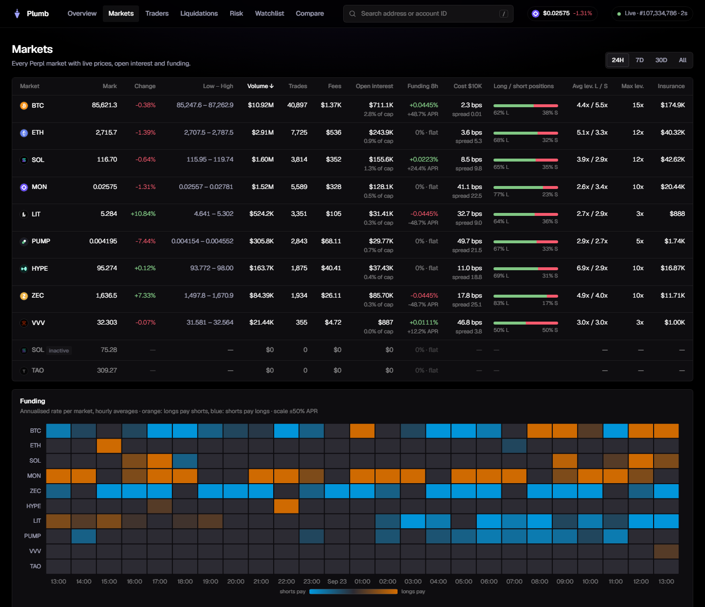
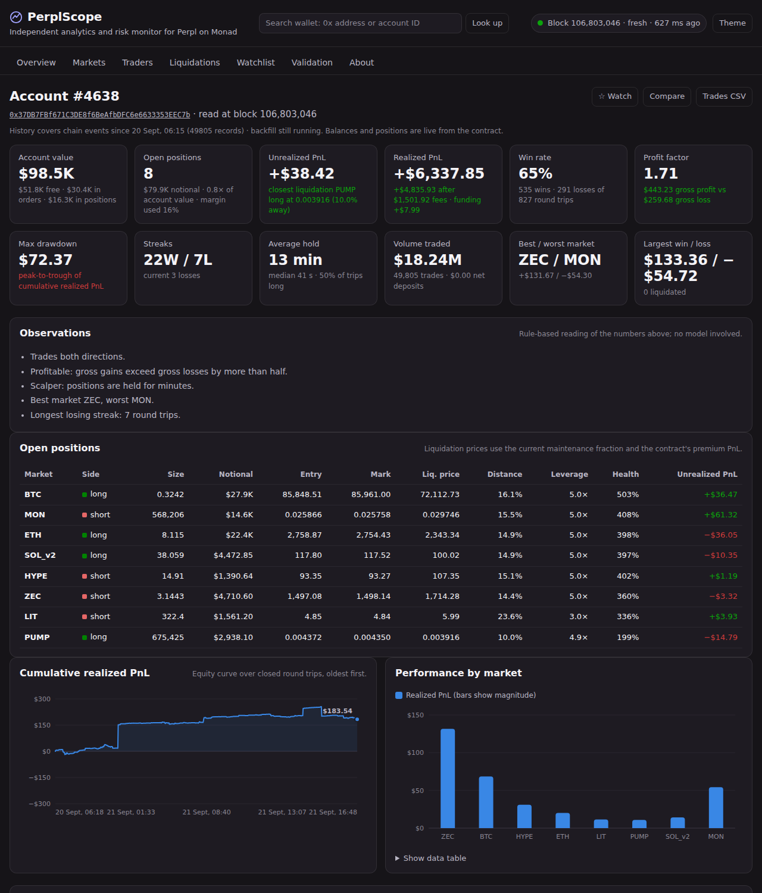
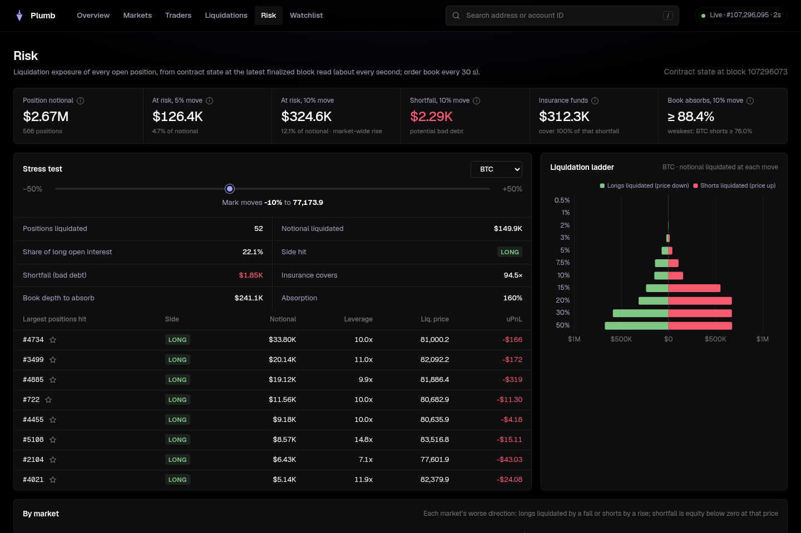

# Plumb

**Onchain analytics, risk data and trading automation for
[Perpl](https://perpl.xyz) on Monad.**

Plumb indexes every event the Perpl exchange has emitted since launch and
reads live positions, the order book and funding from the contract. The
dashboard answers three questions:
- **the protocol view**: what is happening on the exchange;
- **the wallet view**: how a given trader is doing;
- **the risk view**: what a price move would do to the open positions.

The same data is served as an open API, and a trading bot built on it is
next. Everything is indexed directly from Monad: no Perpl API and no
third-party indexer sit in between.

**Live:** [plumb.huginn.tech](https://plumb.huginn.tech) ·
**API:** [docs/api.md](docs/api.md) ·
**Demo video:** added before submission

[](https://github.com/s0urledd/plumb/actions/workflows/ci.yml)
[](LICENSE)


## Monad Metropolis entry

| | |
| --- | --- |
| Track | 01 · Onchain Finance & Trading |
| Perpl bounty: Best Analytics / Risk Tool | The dashboard and its API. Live on mainnet data. |
| Perpl bounty: Best use of Perpl's API | A trading bot built on Plumb's data. In progress, see [Trading bot](#trading-bot). |

Who it is for: Perpl traders who want to see where the market is positioned
and how a wallet really performs, and anyone who needs to know how much risk
sits in the open positions (the team, market makers, integrators).

## Protocol

- **Headline metrics** for 24h, 7d, 30d and all time. Each card names its
  period; flows over a window are compared with the previous window.
  - volume, open interest and TVL (open interest and TVL are "now");
  - fees, with the protocol share shown as revenue;
  - active traders and new accounts;
  - liquidations.
- **Time series** per hour, four hours or day:
  - trading volume stacked by market, per period or cumulative;
  - open interest and TVL;
  - deposits against withdrawals, with the net per period;
  - active traders, fees, liquidations by market;
  - realized PnL of all traders, and taker buying against selling.

  Every chart downloads as CSV or PNG.
- **Markets** table: price and change, volume and share, open interest,
  funding per 8 h and APR, long/short skew, taker buy share, traders,
  liquidations. Each market has its own page with candles built from fills,
  positioning, the largest open positions, funding history, the liquidation
  ladder, top traders and a live tape.
- **Live trades** as they finalize, labelled by what the trader did (open,
  add, reduce, close, flip, liquidated), with a size filter. Trades from
  proposed blocks appear first, dimmed, within milliseconds.
- **Liquidations**, **funding** across markets and over time, and the
  largest **depositors and withdrawers**.
- **Market share**: Perpl's open interest against other perp venues and
  within Monad (DefiLlama data, labelled as such and never mixed into
  Plumb's own figures).



## Wallets and traders



Search any address or account ID (`/` focuses the search), or click any
trader anywhere.

- **Portfolio** from contract state: account value, free and locked balance,
  margin usage, leverage, distance to the closest liquidation, and every open
  position with entry, mark, unrealized PnL and liquidation price.
- **By period** (24h, 7d, 30d, all time): volume, trades, net PnL, PnL per
  volume, and the wallet's **rank** by PnL and by volume among every account
  that traded in the same window.
- **Performance** over closed round trips: win rate, profit factor,
  expectancy, largest win and loss, max drawdown with its dates, streaks,
  hold times of winners against losers, long against short, best and worst
  market.
- **PnL** as a cumulative curve, daily bars or a calendar of green and red
  days.
- **Trade history** with the price, size and fee of the fill behind each
  position change, maker or taker role and realized PnL; CSV export. Round
  trips, deposits and withdrawals have their own tabs.
- **Behaviour**: rule-based notes (scalper or swing style, holding losers
  longer than winners, typical leverage, active hours) and a weekday × hour
  activity map.
- **Watchlist**, **compare** up to five wallets side by side, and a **share
  card**: a PNG summary of the wallet drawn in the browser.
- **Traders** page:
  - **positioning by cohort**: open positions grouped by account size
    (whales to shrimp) and by track record (top winners to rekt), with each
    cohort's long/short split, unrealized PnL and largest wallets;
  - a leaderboard for any window by net PnL, losses, volume, fees,
    liquidations or net inflow.

## Risk

Perpl keeps its order book and positions in the contract, so risk can be
measured instead of estimated:
- **notional at risk** if every market moves 5 % or 10 % the same way;
- the **liquidation ladder** per market;
- **bad debt** past bankruptcy, and how much of it each market's insurance
  fund covers;
- **order-book absorption**: resting depth walked from the contract against
  the liquidations a move would force into it;
- the **cost of a market order** of $1K, $10K and $100K per market;
- an interactive **stress test**.



## How it uses Monad

| | |
| --- | --- |
| Network | Monad mainnet (chain 143) |
| Perpl exchange | [`0x34B6552d57a35a1D042CcAe1951BD1C370112a6F`](https://monadvision.com/address/0x34B6552d57a35a1D042CcAe1951BD1C370112a6F) (contract version 1.7.4) |
| Collateral (AUSD) | [`0x00000000eFE302BEAA2b3e6e1b18d08D69a9012a`](https://monadvision.com/address/0x00000000eFE302BEAA2b3e6e1b18d08D69a9012a) |
| Multicall3 | `0xca11bde05977b3631167028862be2a173976ca11` |
| History since | block 54,773,010 (11 February 2026), about 67 million events |

What Plumb reads, all from a self-hosted Monad mainnet node:
- **exchange events** with `eth_getLogs` over finalized block ranges: fills,
  position changes, funding, liquidations, deposits and withdrawals;
- **contract state** with `eth_call` at explicit blocks, batched through
  Multicall3: every open position, market parameters, the on-chain order
  book, insurance funds and the exchange balance;
- **execution events** from the node's shared-memory event ring, through a
  [Monode](https://github.com/monad-developers/monode) sidecar, so trades
  from proposed blocks reach the dashboard within milliseconds.

Why this works on Monad: blocks come every 0.3 s and Perpl is a full
on-chain order book. Positions, resting orders and funding are all contract
state, so the dashboard is about a second behind the chain and the risk
figures come from real positions and real depth, not models.

## Why the numbers hold

- **Finalized blocks only.** History and state are read at finalized blocks,
  so no stored number is ever rolled back (only the dimmed trades of
  proposed blocks are provisional).
- **Each event exactly once.** Coverage is tracked as block intervals. A
  range is recorded only after its rows are stored, and an interrupted
  commit is cleaned up on restart.
- **Trades priced from their fills.** Every position change is linked to
  the fill that settled it: 33,557,868 of 33,557,868 position events over
  the full history. The insurance and protocol fee split equals the fill fee
  on all 18,630,950 fills that build a position.
- **History reproduces the contract.** On 23 September 2026 at block
  107,279,223, 67 million events since launch were summed and compared with
  the contract ([evidence](docs/evidence/integrity-2026-09-23.json), live at
  `/api/v1/integrity`):
  - open interest matched the contract's counters exactly, for all
    11 markets and both sides;
  - the net collateral flow matched the exchange's balance to the
    micro-dollar ($3,942,293.243869).
- **PnL as the contract settles it.** Funding realized when a position is
  increased and the share of margin a liquidation keeps are counted; the
  size of these corrections is recorded in
  [evidence](docs/evidence/pnl-corrections-2026-09-23.json).
- **Live positions are reconciled** with the open-interest counters every
  poll, and rescanned through an independent path every hour.
- **Matches the venue.** On 23 September 2026 the 24 h volume summed from
  maker fills was within 0.04 % of Perpl's own figure, and every active
  market within 0.1 %. Perpl's API is used for this check only, never as an
  input.
- **Coverage is stated, never assumed.** While history is being indexed,
  every window says whether it is complete.

Details: [methodology](docs/methodology.md) · [architecture](docs/architecture.md) ·
[freshness measurements](docs/architecture.md#freshness).

## Architecture

```
  Monad node (self-hosted)                        Plumb (docker compose)
  ----------------------------                    ----------------------------------
  monad-execution                                 ingest     events -> ClickHouse
    shared-memory event ring --> Monode sidecar -->  (wake-up on new blocks)
  monad-rpc                                        collector  contract state, risk
    JSON-RPC  (eth_getLogs, eth_call) ------------>  (every commit, order book 30 s)
    WebSocket (newHeads, fallback) --------------->
                                                  ClickHouse events, hourly rollups
                                                  API        JSON, CSV, SSE stream
                                                  web/       dashboard (no build step)
```

- **Ingest** follows the finalized head, decodes exchange logs and links
  every position change to its fill. A backfill fills history from launch,
  newest first, and records coverage as block intervals.
- **Collector** reads every open position and the order book at a pinned
  block and computes margin, liquidation prices, the ladder and the stress
  figures in exact integer arithmetic.
- **ClickHouse** stores events and hourly rollups; windows are answered from
  rollups plus the raw events at their edges.
- **API** serves the dashboard and anyone else: JSON, CSV for tables, and a
  server-sent event stream for blocks, trades and liquidations. Per-IP rate
  limits apply.

## Tech stack

| Layer | Used |
| --- | --- |
| Chain access | Self-hosted Monad mainnet node (monad-rpc, execution event ring), [Monode](https://github.com/monad-developers/monode) sidecar, [viem](https://viem.sh) for ABI decoding |
| Server | Node.js 22+, no framework |
| Storage | ClickHouse 26.8 |
| Dashboard | Plain JavaScript modules, [Apache ECharts](https://echarts.apache.org), [Geist](https://vercel.com/font) font; all served from the app, no CDN |
| Deployment | Docker Compose behind nginx with TLS, on the host of the Monad node |
| CI | GitHub Actions: unit tests on Node 22 and 24, ClickHouse integration test, Docker build |

## Trading bot

For the **Best use of Perpl's API** bounty we are building a trading bot on
top of Plumb, in this repository. It is not live yet; this section will
describe the strategy, the risk limits and the on-chain record once it
trades on mainnet.

The plan:
- trade through Perpl's official API and SDK, with Plumb's data as the
  signal (leaderboards, cohorts, live positions and the order book);
- strict risk limits: position and leverage caps, a floor on the distance to
  liquidation, a daily loss limit with a kill switch, slippage checks against
  the book before every order;
- run as a separate service with its own keys, so the analytics side stays
  read-only;
- publish every order and fill with its transaction hash on a Bot page of
  the dashboard, and back-test the strategy on the full indexed history
  first.

## Run it

On the Monad node's host, with Docker:

```bash
cp .env.example .env          # MONAD_RPC_URL, ARCHIVE_RPC_URLS, CLICKHOUSE_PASSWORD
docker compose up -d --build  # app + ClickHouse on 127.0.0.1:8787
# optional: execution events from the node's shared-memory ring
docker compose --profile exec-events up -d --build
```

The live loop starts at once. History since launch (about 52 million blocks)
is indexed in the background in one to three hours, and the dashboard shows
the progress. The [runbook](docs/runbook.md) covers the reverse proxy,
enabling the execution event ring, configuration and operations.

## API

Everything on the dashboard is available as JSON, and as CSV for tables. A
server-sent event stream pushes new blocks, trades and liquidations.

```bash
curl -s 'https://plumb.huginn.tech/api/v1/protocol?window=7d' | jq .headline.volume
curl -s 'https://plumb.huginn.tech/api/v1/leaderboard?window=30d&by=pnl&limit=10'
curl -s  https://plumb.huginn.tech/api/v1/cohorts | jq '.by_size[] | {label, long_share_pct}'
curl -N  https://plumb.huginn.tech/api/v1/stream
```

Amounts are exact decimal strings, and every response says which block it
was computed at and whether its window is complete. See [API](docs/api.md).

## Development

```bash
npm ci
npm run check                 # syntax of every file
npm test                      # unit tests against a fake exchange, no network
CLICKHOUSE_URL=http://127.0.0.1:8123 npm run test:integration
npm start                     # needs MONAD_RPC_URL and a ClickHouse (see the runbook)
```

| Path | Contents |
| --- | --- |
| `src/ingest.js`, `src/decode.js`, `src/coverage.js` | Event ingest, decoding and linking, coverage |
| `src/schema.js`, `src/rollup.js`, `src/aggregates.js`, `src/query.js` | ClickHouse schema, rollups, window queries |
| `src/analytics-api.js`, `src/analytics.js`, `src/cohorts.js` | Protocol, trader, cohort and wallet analytics |
| `src/collector.js`, `src/state.js`, `src/metrics.js`, `src/book.js`, `src/math.js` | Contract state and risk |
| `src/api.js`, `src/live.js`, `src/server.js`, `src/ratelimit.js` | HTTP, server-sent events, execution events, rate limits, wiring |
| `src/landscape.js`, `src/reference.js` | External context (market share) and the optional check against Perpl's API |
| `web/` | Dashboard |
| `deploy/` | ClickHouse settings, the Monode sidecar image and its event filter |
| `docs/` | Architecture, methodology, API, runbook, evidence |

## AI assistance

We used Claude Code as a coding assistant for parts of the code, tests and
docs. Design, infrastructure, data validation and review are the team's.

## Attribution

- ABI subset from the MIT-licensed `perpl-sdk` crate
  ([abi/README.md](abi/README.md)).
- [viem](https://github.com/wevm/viem) (MIT),
  [Apache ECharts](https://github.com/apache/echarts) (Apache 2.0),
  [Geist](https://github.com/vercel/geist-font) (SIL OFL 1.1),
  [ClickHouse](https://github.com/ClickHouse/ClickHouse) (Apache 2.0),
  [Monode](https://github.com/monad-developers/monode) (built from a pinned
  commit, `deploy/monode/Dockerfile`).
- Market-share context from [DefiLlama](https://defillama.com/open-interest).
- Market and venue logos are trademarks of their owners, used only to
  identify each market or venue; sources in
  [web/img/markets/README.md](web/img/markets/README.md) and
  [web/img/venues/README.md](web/img/venues/README.md).

## Documentation

[Architecture](docs/architecture.md) · [Methodology](docs/methodology.md) ·
[API](docs/api.md) · [Runbook](docs/runbook.md) ·
[Data sources](docs/data-sources.md) · [Landscape](docs/landscape.md) ·
[Validation evidence](docs/validation-gate.md) · [Submission](docs/submission.md)

---

Built by [Huginn](https://huginn.tech) for the Monad Metropolis hackathon,
from 12 September 2026. Unofficial: not affiliated with or endorsed by Perpl or the Monad
Foundation. [MIT licensed](LICENSE).
