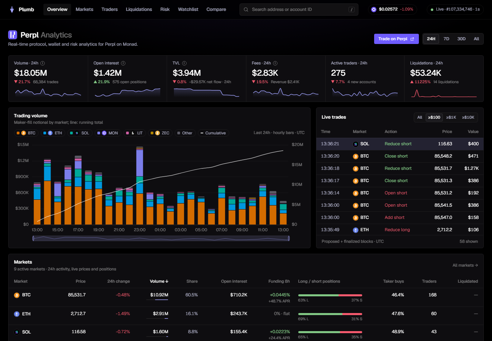

# PerplScope

**Real-time protocol and wallet analytics for [Perpl](https://perpl.xyz) on
Monad, read straight from the chain.**

PerplScope indexes every event the Perpl exchange has emitted since launch
and reads live positions from the contract. It answers two questions in one
place:
- **the protocol view**: what is happening on the exchange;
- **the wallet view**: how a given trader is doing.

It needs no Perpl API: a Monad node is its only source.

[](https://github.com/s0urledd/perpl-scope/actions/workflows/ci.yml)



## Protocol

- **Headline metrics** for 24h, 7d, 30d and all time, each compared with the
  previous period:
  - volume, open interest, TVL;
  - fees, with the protocol, insurance-fund and builder split, and the take
    rate;
  - active traders and new accounts;
  - liquidations;
  - deposits, withdrawals and net flow.
- **Time series** per hour, four hours or day:
  - trading volume stacked by market, per period or cumulative, with a
    legend to toggle series;
  - open interest, TVL, net deposits, active traders, fees, liquidations by
    market.

  Every chart downloads as CSV or PNG.
- **Markets** table:
  - price and change, volume and share, open interest;
  - funding per 8 h and APR;
  - long/short position skew, taker buy share, traders, liquidations.

  Each market has a page with fill-built candles, positioning, funding
  history, the liquidation ladder, top traders and a live tape.
- **Live trades** as they finalize, labelled by what the trader did (open,
  add, reduce, close, flip, liquidated), with a size filter. With the node's
  execution events enabled, trades from proposed blocks appear first,
  dimmed.
- **Liquidations** page, **funding** across markets and over time, and
  **deposit and withdrawal flows**.

## Wallets

Search any address or account ID (`/` focuses the search), or click any
trader anywhere.

- **Portfolio** from contract state:
  - account value, free and locked balance, margin usage, effective
    leverage, distance to the closest liquidation;
  - every open position with size, entry, mark, leverage, unrealized PnL,
    liquidation price and margin.
- **By period** (24h, 7d, 30d, all time): volume, trades, net PnL, PnL per
  volume, and the wallet's **rank** by PnL and by volume among every account
  that traded in the same window.
- **Performance** over closed round trips:
  - win rate, profit factor, expectancy;
  - largest win and loss, max drawdown with its dates, best and worst
    streaks;
  - hold times (winners against losers), long against short;
  - best and worst market;
  - a cumulative PnL curve.
- **Trade history**: every position change with the price, size and fee of
  the fill that settled it, maker or taker role, and realized PnL; paginated
  and exported as CSV. Round trips, deposits and withdrawals have their own
  tabs.
- **Behaviour**: rule-based notes such as scalper or swing style, holding
  losers longer than winners, typical leverage and active hours, and a
  weekday × hour activity map.
- **Watchlist** (kept in the browser) and **compare** up to five wallets
  side by side, with their PnL curves overlaid.
- **Traders** leaderboard for any window by net PnL, losses, volume, fees
  or liquidated notional, with open positions now, CSV export and paging.

## Risk

The exchange's order book and positions live in the contract, so risk can be
measured instead of estimated:
- the **liquidation ladder** and map per market;
- **bad debt** past bankruptcy and the insurance fund's cover;
- **order-book cover**: resting depth walked from the contract against the
  liquidation flow that a move would force into it;
- an interactive **stress test**;
- the **auto-deleveraging queue**;
- health for every position, and concentration and insurance per market.

## Why the numbers hold

- **Finalized blocks only.** History and state are read at finalized blocks,
  so nothing shown is ever rolled back.
- **Each event exactly once.** Coverage is tracked as block intervals. A
  range is recorded only after its rows are stored, and an interrupted
  commit is cleaned up on restart.
- **Trades priced from their fills.** Every position change is linked to the
  fill that settled it. Over 400,000 live blocks, 154,264 of 154,264 linked,
  with no size mismatch.
- **Reconciled against the contract.**
  - Open interest summed from every event since launch must equal the
    contract's counters, and net flows its collateral balance
    (`/api/v1/integrity`).
  - Live positions are reconciled with the open-interest counters every
    poll, and rescanned through an independent path every hour.
- **Coverage is stated, never assumed.** While history is being indexed,
  every window says whether it is complete.

Details: [methodology](docs/methodology.md) · [architecture](docs/architecture.md).

## Run it

On the Monad node's host, with Docker:

```bash
cp .env.example .env          # MONAD_RPC_URL, ARCHIVE_RPC_URLS, CLICKHOUSE_PASSWORD
docker compose up -d --build  # app + ClickHouse on 127.0.0.1:8787
# optional: execution events from the node's shared-memory ring
docker compose --profile exec-events up -d --build
```

The live loop starts at once. History since launch (about 52 million blocks)
is indexed in the background in one to three hours, and the dashboard shows
the progress. [Runbook](docs/runbook.md) covers the reverse proxy, enabling
the execution event ring, configuration and operations.

## API

Everything on the dashboard is available as JSON, and as CSV for tables. A
server-sent event stream pushes new blocks and trades.

```bash
curl -s 'localhost:8787/api/v1/protocol?window=7d' | jq .headline.volume
curl -s 'localhost:8787/api/v1/leaderboard?window=30d&by=pnl&limit=10'
curl -s  localhost:8787/api/v1/wallets/<address>/periods
curl -N  localhost:8787/api/v1/stream
```

See [API](docs/api.md).

## Development

```bash
npm ci
npm run check                 # syntax of every file
npm test                      # unit tests against a fake exchange, no network
CLICKHOUSE_URL=http://127.0.0.1:8123 npm run test:integration
npm start                     # needs MONAD_RPC_URL and a ClickHouse (see runbook)
```

| Path | Contents |
| --- | --- |
| `src/ingest.js`, `src/decode.js`, `src/coverage.js` | Event ingest, decoding and linking, coverage |
| `src/schema.js`, `src/rollup.js`, `src/aggregates.js`, `src/query.js` | ClickHouse schema, rollups, window queries |
| `src/analytics-api.js`, `src/analytics.js` | Protocol, trader and wallet analytics |
| `src/collector.js`, `src/state.js`, `src/metrics.js`, `src/book.js`, `src/math.js` | Contract state and risk |
| `src/api.js`, `src/live.js`, `src/server.js` | HTTP, server-sent events, execution events, wiring |
| `web/` | Dashboard (no build step; ECharts and Geist served locally) |
| `deploy/` | ClickHouse settings, the Monode sidecar image and its event filter |

## Documentation

[Architecture](docs/architecture.md) · [Methodology](docs/methodology.md) ·
[API](docs/api.md) · [Runbook](docs/runbook.md) ·
[Data sources](docs/data-sources.md) · [Landscape](docs/landscape.md) ·
[Validation evidence](docs/validation-gate.md) · [Submission](docs/submission.md)

---

Unofficial analytics, built for the Monad Metropolis hackathon. Not
affiliated with or endorsed by Perpl or the Monad Foundation. MIT licensed.
The ABI subset comes from the MIT-licensed `perpl-sdk` crate (see
[abi/README.md](abi/README.md)).
