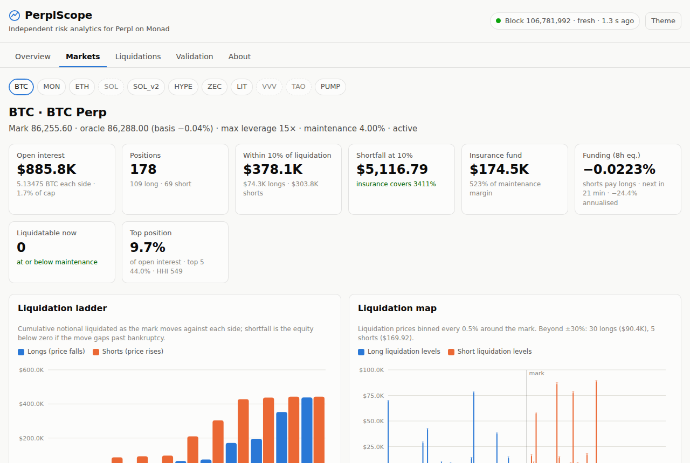

# PerplScope

**Independent risk analytics for [Perpl](https://perpl.xyz) on Monad.**
Liquidation exposure, open interest, funding and insurance coverage, computed
directly from the exchange contract at a pinned block and continuously checked
against the contract's own counters.

[](https://github.com/s0urledd/perpl-scope/actions/workflows/ci.yml)

PerplScope answers the questions a risk desk asks about a perpetual venue and
that a venue's own UI does not: how much notional liquidates if the mark moves
5 % or 10 %, where the liquidation levels cluster, whether the insurance fund
covers the shortfall if price gaps through bankruptcy, how concentrated each
side is, and how funding has behaved. Nothing is taken on trust from the
venue: Perpl's public API appears only in a cross-check panel.


## What it shows

- **Liquidation ladder**: cumulative notional liquidated per side at adverse
  moves from 0.5 % to 50 %, with the shortfall beyond bankruptcy at each step
  and the insurance fund's coverage of it.
- **Liquidation map**: liquidation prices of every open position binned every
  0.5 % around the mark, longs below and shorts above.
- **Open interest** per side, reconciled to the contract's counters at every
  block, plus utilisation of the market's open-interest cap.
- **Position health**: equity over maintenance margin, liquidatable and
  bankrupt counts, distance to liquidation and effective leverage per position.
- **Funding**: current rate per interval with 8 h and annualised equivalents,
  countdown to the next funding block, and the event history.
- **Insurance and concentration**: insurance balance against notional and
  maintenance margin, top-1/5/10 shares and HHI per side.
- **Liquidation feed** and parameter-change log from exchange events.
- A **validation page** showing the live checks and the Perpl API cross-check.

Everything is served as a JSON API (`/api/v1/...`) and a dependency-free
dashboard.



## How it stays honest

1. **Pinned reads.** Every value in a snapshot comes from `eth_call` at one
   block whose hash is re-checked before the snapshot is published.
2. **Positions from getters, never from events.** The contract's paged
   `getPositionsV2` provides the bootstrap; afterwards each block's exchange
   events only name the positions to re-read.
3. **Reconciliation every poll.** Stored positions summed per side must equal
   `getPerpetualInfoV2` open-interest counters at the same block, or the state
   is marked stale and rebuilt.
4. **Independent discovery.** Periodically every account is rescanned through
   its position bitmaps, an enumeration path that shares nothing with the
   paged getter, and compared with the stored positions.
5. **Formula validation on live data.** Delta PnL is recomputed and compared
   with the contract for every open position; funding premium changes were
   checked across live funding events; liquidation classification was checked
   against actual on-chain liquidations. See [validation evidence](docs/validation-gate.md).

| Check (mainnet, 2026-09-21) | Result |
| --- | --- |
| Open interest, paged positions vs contract counters, 11 markets | exact |
| Independent account-bitmap rescan vs stored positions, 5,311 accounts | agrees |
| Delta PnL recomputed vs `getPositionsV2`, 557 positions | 557 / 557 |
| Premium PnL change across live funding events, 208 positions | 208 / 208 |
| Perpl public API vs contract: margins, funding rate and sum | match |

## Quick start

Requires Node.js 22.9 or later and an HTTPS Monad JSON-RPC endpoint. The
public `https://rpc.monad.xyz` works (100-block `eth_getLogs` limit, recent
state only).

```bash
npm ci
cp .env.example .env        # set MONAD_RPC_URL
npm test                    # offline tests, fixtures only
npm start                   # collector + API + dashboard on http://localhost:8787
```

The first snapshot takes a few seconds; the header shows the block, freshness
and age of the state every page is computed from.

Docker:

```bash
docker build -t perpl-scope .
docker run -p 8787:8787 -v perpl-data:/data -e MONAD_RPC_URL=https://rpc.monad.xyz perpl-scope
```

## Configuration

| Variable | Default | Meaning |
| --- | --- | --- |
| `MONAD_RPC_URL` | required | HTTPS JSON-RPC endpoint; never logged |
| `CHAIN_ID` | `143` | Expected chain |
| `EXCHANGE_ADDRESS` | mainnet Perpl exchange | Contract address |
| `PORT`, `HOST` | `8787`, `0.0.0.0` | HTTP listener |
| `POLL_MS` | `2000` | Head polling interval |
| `LOG_RANGE` | `100` | Blocks per `eth_getLogs` request (raise on providers that allow it) |
| `BACKFILL_BLOCKS` | `3000` | History backfill at start |
| `FUNDING_HISTORY_EVENTS` | `48` | Funding events fetched per market at start |
| `VERIFY_BLOCKS` | `12000` | Blocks between independent rescans (about one hour) |
| `CHECKPOINT_PATH` | `data/checkpoint.json` | Atomic state checkpoint |
| `MAX_RESUME_GAP` | `20000` | Oldest checkpoint resumed without a fresh bootstrap |
| `STALE_AFTER_MS` | `45000` | Freshness threshold |
| `RPC_TIMEOUT_MS`, `RPC_MAX_BYTES` | `15000`, 4 MiB | Per-request limits |
| `REFERENCE_DISABLED` | unset | `1` disables the Perpl API cross-check |

## Diagnostics

The original validation tooling remains available: `npm run validate`
(bounded preflight), `npm run snapshot` (full account-bitmap discovery with
open-interest reconciliation), `node --env-file=.env src/replay.js` (size and
side replay between two snapshots), the WebSocket probes, and
`npm run validate:math` (live formula validation, writes
`reports/validation-math.json`).

## Documentation

[Architecture](docs/architecture.md) · [Methodology](docs/methodology.md) ·
[Validation evidence](docs/validation-gate.md) · [API](docs/api.md) ·
[Runbook](docs/runbook.md) · [Data sources](docs/data-sources.md) ·
[Demo](docs/demo.md) · [Submission](docs/submission.md)

## Limits

- Isolated-margin positions only, as deployed. Order books are not modelled.
- Liquidation prices use the current maintenance fraction and the contract's
  current premium PnL; funding accrued between events is not projected.
- Liquidation history covers the backfill window and everything since.
- Historical position reads depend on the RPC provider's state retention.

Built for the Monad Metropolis hackathon. MIT licensed; the ABI subset is
extracted from the MIT-licensed `perpl-sdk` crate (see [abi/README.md](abi/README.md)).
